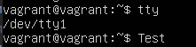

# Домашнее задание к занятию "3.2. Работа в терминале, лекция 2"

1. Какого типа команда `cd`? Попробуйте объяснить, почему она именно такого типа; опишите ход своих мыслей, если считаете что она могла бы быть другого типа.  
```bash
vagrant@vagrant:~$ type cd  
cd is a shell builtin 
```
`cd` это встроенная в оболочку комманда.

2. Какая альтернатива без pipe команде `grep <some_string> <some_file> | wc -l`? `man grep` поможет в ответе на этот вопрос. Ознакомьтесь с [документом](http://www.smallo.ruhr.de/award.html) о других подобных некорректных вариантах использования pipe.  
```bash
grep -c <some_string> <some_file>
```
3. Какой процесс с PID `1` является родителем для всех процессов в вашей виртуальной машине Ubuntu 20.04?

systemd  
```bash
vagrant@vagrant:~$ ps  1  
    PID TTY      STAT   TIME COMMAND  
      1 ?        Ss     0:13 /lib/systemd/systemd --system --deserialize 31  
```
4. Как будет выглядеть команда, которая перенаправит вывод stderr `ls` на другую сессию терминала?  

```bash
vagrant@vagrant:~$ tty  
/dev/pts/0  
vagrant@vagrant:~$ ls -0 2>/dev/pts/1    
vagrant@vagrant:~$  
```
```bash
vagrant@vagrant:~$ tty  
/dev/pts/1  
vagrant@vagrant:~$ ls: invalid option -- '0'  
Try 'ls --help' for more information.  
```
5. Получится ли одновременно передать команде файл на stdin и вывести ее stdout в другой файл? Приведите работающий пример.  
```bash
vagrant@vagrant:~$ cat input.txt  
hello  
vagrant@vagrant:~$ cat output.txt  
```
```bash
vagrant@vagrant:~$ tee 0<input.txt 1>output.txt  
vagrant@vagrant:~$ cat output.txt  
hello    
```
6. Получится ли вывести находясь в графическом режиме данные из PTY в какой-либо из эмуляторов TTY? Сможете ли вы наблюдать выводимые данные?  
```bash
vagrant@vagrant:~$ tty  
/dev/pts/0  
vagrant@vagrant:~$ echo Test 1>/dev/tty1  
```

 
7. Выполните команду `bash 5>&1`. К чему она приведет? Что будет, если вы выполните `echo netology > /proc/$$/fd/5`? Почему так происходит?
```bash
vagrant@vagrant:~$ bash 5>&1  
vagrant@vagrant:~$ ls -la /proc/self/fd  
total 0  
dr-x------ 2 vagrant vagrant  0 Feb  6 09:49 .  
dr-xr-xr-x 9 vagrant vagrant  0 Feb  6 09:49 ..  
lrwx------ 1 vagrant vagrant 64 Feb  6 09:49 0 -> /dev/pts/0  
lrwx------ 1 vagrant vagrant 64 Feb  6 09:49 1 -> /dev/pts/0  
lrwx------ 1 vagrant vagrant 64 Feb  6 09:49 2 -> /dev/pts/0  
lr-x------ 1 vagrant vagrant 64 Feb  6 09:49 3 -> /proc/33420/fd  
lrwx------ 1 vagrant vagrant 64 Feb  6 09:49 5 -> /dev/pts/0  
```
Запустится экземпляр bash с fd 5 и перенаправится на fd1 (stdout)  
```bash
vagrant@vagrant:~$ echo netology > /proc/$$/fd/5  
netology  
```
echo отправит `netology` в fd 5 текущего экземпляра bash и далее на stdout   

8. Получится ли в качестве входного потока для pipe использовать только stderr команды, не потеряв при этом отображение stdout на pty? Напоминаем: по умолчанию через pipe передается только stdout команды слева от `|` на stdin команды справа.
Это можно сделать, поменяв стандартные потоки местами через промежуточный новый дескриптор, который вы научились создавать в предыдущем вопросе.
```bash
vagrant@vagrant:~$ ls -l test1.md  
-rw-rw-r-- 1 vagrant vagrant 6 Feb  5 12:12 test1.md  
vagrant@vagrant:~$ ls -l test2.md  
ls: cannot access 'test2.md': No such file or directory  
vagrant@vagrant:~$ ls -l test1.md 5>&2 2>&1 1>&5 |grep "No such file" -c  
-rw-rw-r-- 1 vagrant vagrant 6 Feb  5 12:12 test1.md  
0  
vagrant@vagrant:~$ ls -l test2.md 5>&2 2>&1 1>&5 |grep "No such file" -c    
1  
```
9. Что выведет команда `cat /proc/$$/environ`? Как еще можно получить аналогичный по содержанию вывод?

Выведет список переменных окружения. Аналог - команда `env`

10. Используя `man`, опишите что доступно по адресам `/proc/<PID>/cmdline`, `/proc/<PID>/exe`.
 
/proc/<PID>/cmdline
Полная командная строка для процесса, если только он не зомби

/proc/<PID>/exe
Симлинк на текущий путь фактически исполняемой команды. Вызвав /proc/<PID>/exe можно запустить еще одну копию исполняемого файла 

11. Узнайте, какую наиболее старшую версию набора инструкций SSE поддерживает ваш процессор с помощью `/proc/cpuinfo`.
```bash
vagrant@vagrant:~$ cat /proc/cpuinfo  | grep -o 'sse[0-9_]*' | sort -h | uniq
sse  
sse2  
sse3  
sse4_1  
sse4_2 
```
12. При открытии нового окна терминала и `vagrant ssh` создается новая сессия и выделяется pty. Это можно подтвердить командой `tty`, которая упоминалась в лекции 3.2. Однако:

     ```bash
     vagrant@netology1:~$ ssh localhost 'tty'
     not a tty
     ```

     Почитайте, почему так происходит, и как изменить поведение.

При выполнении команды на удаленной машине через `ssh` по умолчанию TTY не выделяется, это позволяет передавать двоичные данные и т.д.
При этом при выполнении `ssh` без запуска удаленной команды TTY создается

Форсировать создание TTY можно ключом `-t`
```bash
vagrant@vagrant:~$ ssh -t localhost 'tty'
vagrant@localhost's password:
/dev/pts/1
Connection to localhost closed.  
```
13. Бывает, что есть необходимость переместить запущенный процесс из одной сессии в другую. Попробуйте сделать это, воспользовавшись `reptyr`. Например, так можно перенести в `screen` процесс, который вы запустили по ошибке в обычной SSH-сессии.
```bash
echo 0 > /proc/sys/kernel/yama/ptrace_scope
top 
```
CTRL+Z
```bash
[1]+  Stopped                 top
vagrant@vagrant:~$ bg
[1]+ top &
vagrant@vagrant:~$ disown top
-bash: warning: deleting stopped job 1 with process group 1991
vagrant@vagrant:~$ ps -a
    PID TTY          TIME CMD
   1629 tty1     00:00:00 bash
   1991 pts/4    00:00:00 top
   2027 pts/4    00:00:00 ps
vagrant@vagrant:~$ tmux

vagrant@vagrant:~$ reptyr 1991
```
14. `sudo echo string > /root/new_file` не даст выполнить перенаправление под обычным пользователем, так как перенаправлением занимается процесс shell'а, который запущен без `sudo` под вашим пользователем. Для решения данной проблемы можно использовать конструкцию `echo string | sudo tee /root/new_file`. Узнайте что делает команда `tee` и почему в отличие от `sudo echo` команда с `sudo tee` будет работать.

`tee` читает `stdin` пишет в `stdout` и в файлы  
В данном примере `tee` получит вывод от `echo` и т.к. `tee` запущена от `sudo`, соответственно имеет повышенные права на запись.