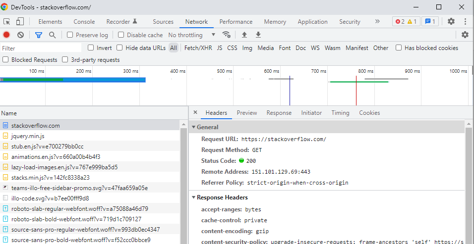
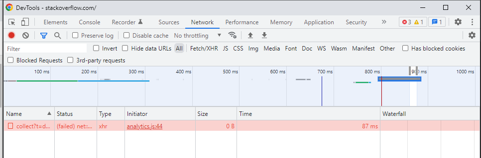
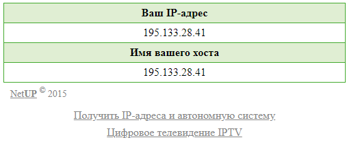

# Домашнее задание к занятию "3.6. Компьютерные сети, лекция 1"

1. Работа c HTTP через телнет.
- Подключитесь утилитой телнет к сайту stackoverflow.com
`telnet stackoverflow.com 80`
- отправьте HTTP запрос
```bash
GET /questions HTTP/1.0
HOST: stackoverflow.com
[press enter]
[press enter]
```
- В ответе укажите полученный HTTP код, что он означает?
```bash
vagrant@vagrant:~$ telnet stackoverflow.com 80
Trying 151.101.1.69...
Connected to stackoverflow.com.
Escape character is '^]'.
GET /questions HTTP/1.0
HOST: stackoverflow.com

HTTP/1.1 301 Moved Permanently
cache-control: no-cache, no-store, must-revalidate
location: https://stackoverflow.com/questions
x-request-guid: 4f2d6fb6-ceec-4fc1-b473-052db21cf773
feature-policy: microphone 'none'; speaker 'none'
content-security-policy: upgrade-insecure-requests; frame-ancestors 'self' https://stackexchange.com
Accept-Ranges: bytes
Date: Fri, 08 Apr 2022 20:06:04 GMT
Via: 1.1 varnish
Connection: close
X-Served-By: cache-ams21038-AMS
X-Cache: MISS
X-Cache-Hits: 0
X-Timer: S1649448364.158514,VS0,VE73
Vary: Fastly-SSL
X-DNS-Prefetch-Control: off
Set-Cookie: prov=fc2ac282-0c16-d177-16e1-d624ef5484fa; domain=.stackoverflow.com; expires=Fri, 01-Jan-2055 00:00:00 GMT; path=/; HttpOnly

Connection closed by foreign host.
```
Код состояния HTTP 301 или Moved Permanently (с англ. — «Перемещено навсегда») — стандартный код ответа HTTP, получаемый в ответ от сервера в ситуации, когда запрошенный ресурс был на постоянной основе перемещён в новое месторасположение, и указывающий на то, что текущие ссылки, использующие данный URL, должны быть обновлены. Адрес нового месторасположения ресурса указывается в поле Location получаемого в ответ заголовка пакета протокола HTTP

2. Повторите задание 1 в браузере, используя консоль разработчика F12.
- откройте вкладку `Network`
- отправьте запрос http://stackoverflow.com
- найдите первый ответ HTTP сервера, откройте вкладку `Headers`
- укажите в ответе полученный HTTP код.
- проверьте время загрузки страницы, какой запрос обрабатывался дольше всего?
- приложите скриншот консоли браузера в ответ.

Первый ответ сервера  
`Status Code: 200 `

Дольше всего обрабатывался `analytics.js`


3. Какой IP адрес у вас в интернете?  


4. Какому провайдеру принадлежит ваш IP адрес? Какой автономной системе AS? Воспользуйтесь утилитой `whois`
```bash
vagrant@vagrant:~$ whois 195.133.28.41
% This is the RIPE Database query service.
% The objects are in RPSL format.
%
% The RIPE Database is subject to Terms and Conditions.
% See http://www.ripe.net/db/support/db-terms-conditions.pdf

% Note: this output has been filtered.
%       To receive output for a database update, use the "-B" flag.

% Information related to '195.133.28.0 - 195.133.31.255'

% Abuse contact for '195.133.28.0 - 195.133.31.255' is 'info@relcom.com'

inetnum:        195.133.28.0 - 195.133.31.255
netname:        Telecom_Service
country:        RU
geoloc:         51.672040 39.184300
admin-c:        FK3647-RIPE
tech-c:         FK3647-RIPE
mnt-domains:    v_stafutin
mnt-domains:    RELCOMGROUP-EXT-MNT
status:         ASSIGNED PA
mnt-by:         RELCOMGROUP-EXT-MNT
created:        2021-03-01T12:32:12Z
last-modified:  2021-03-29T14:08:12Z
source:         RIPE

person:         Vitaly Stafutin
address:        Russia Voronezh
phone:          +74733004000
nic-hdl:        FK3647-RIPE
mnt-by:         v_stafutin
created:        2016-09-06T08:28:22Z
last-modified:  2018-12-05T21:00:44Z
source:         RIPE

% Information related to '195.133.28.0/24AS60840'

route:          195.133.28.0/24
origin:         AS60840
mnt-by:         RELCOMGROUP-EXT-MNT
created:        2021-03-29T14:10:04Z
last-modified:  2021-03-29T14:10:04Z
source:         RIPE

% This query was served by the RIPE Database Query Service version 1.102.3 (HEREFORD) 
```
Провайдер `Telecom_Service`, автономная система `AS60840`
 
5. Через какие сети проходит пакет, отправленный с вашего компьютера на адрес 8.8.8.8? Через какие AS? Воспользуйтесь утилитой `traceroute`
```bash
vagrant@vagrant:~$ traceroute 8.8.8.8 -n -A -I
traceroute to 8.8.8.8 (8.8.8.8), 30 hops max, 60 byte packets
 1  10.0.2.2 [*]  1.148 ms  1.053 ms  0.982 ms
 2  100.64.0.1 [*]  2.074 ms  2.439 ms  2.299 ms
 3  10.0.0.1 [*]  3.965 ms  4.390 ms  4.181 ms
 4  172.28.128.1 [*]  3.472 ms  3.403 ms  3.335 ms
 5  195.208.208.232 [AS5480]  11.358 ms  11.650 ms  11.582 ms
 6  108.170.250.130 [AS15169]  11.481 ms  11.814 ms  15.208 ms
 7  142.251.238.84 [AS15169]  27.508 ms  27.036 ms  26.957 ms
 8  142.251.238.68 [AS15169]  23.473 ms  23.836 ms  23.770 ms
 9  216.239.58.67 [AS15169]  25.042 ms  25.388 ms  26.150 ms
10  * * *
11  * * *
12  * * *
13  * * *
14  * * *
15  * * *
16  * * *
17  * * *
18  * * *
19  * * *
20  * * *
21  8.8.8.8 [AS15169]  24.299 ms  25.518 ms  25.439 ms
```
Автономные системы `AS5480`, `AS15169`  

6. Повторите задание 5 в утилите `mtr`. На каком участке наибольшая задержка - delay?
```bash
 vagrant@vagrant:~$ mtr 8.8.8.8 -n -z

                                 My traceroute  [v0.93]
vagrant (10.0.2.15)                                            2022-04-08T20:38:10+0000
Keys:  Help   Display mode   Restart statistics   Order of fields   quit
                                               Packets               Pings
 Host                                        Loss%   Snt   Last   Avg  Best  Wrst StDev
 1. AS???    10.0.2.2                         0.0%     6    0.9   0.8   0.7   0.9   0.1
 2. AS???    100.64.0.1                       0.0%     6    1.5   1.6   1.5   1.7   0.1
 3. AS???    10.0.0.1                         0.0%     5    2.2   2.2   2.1   2.4   0.1
 4. AS???    172.28.128.1                     0.0%     5    2.6   2.4   2.1   2.6   0.2
 5. AS???    195.208.208.232                  0.0%     5   11.1  11.5  11.0  12.7   0.7
 6. AS15169  108.170.250.130                  0.0%     5   11.8  11.9  11.8  12.0   0.1
 7. AS15169  142.251.238.84                   0.0%     5   27.0  28.5  26.8  30.8   2.1
 8. AS15169  142.251.238.68                   0.0%     5   24.1  30.1  24.0  53.8  13.2
 9. AS15169  216.239.58.67                    0.0%     5   25.4  25.7  25.2  26.2   0.4
10. (waiting for reply)
11. (waiting for reply)
12. (waiting for reply)
13. (waiting for reply)
14. (waiting for reply)
15. (waiting for reply)
16. (waiting for reply)
17. (waiting for reply)
18. (waiting for reply)
19. (waiting for reply)
20. (waiting for reply)21. AS15169  8.8.8.8   0.0%     5   24.4  24.3  24.1  24.6   0.2
```
Самая большая задержка здесь
`8. AS15169  142.251.238.68                   0.0%    48   23.9  29.1  23.8 103.2  13.2`  

7. Какие DNS сервера отвечают за доменное имя dns.google? Какие A записи? воспользуйтесь утилитой `dig`
```bash
vagrant@vagrant:~$ dig dns.google

; <<>> DiG 9.16.1-Ubuntu <<>> dns.google
;; global options: +cmd
;; Got answer:
;; ->>HEADER<<- opcode: QUERY, status: NOERROR, id: 54608
;; flags: qr rd ra; QUERY: 1, ANSWER: 2, AUTHORITY: 0, ADDITIONAL: 1

;; OPT PSEUDOSECTION:
; EDNS: version: 0, flags:; udp: 65494
;; QUESTION SECTION:
;dns.google.                    IN      A

;; ANSWER SECTION:
dns.google.             438     IN      A       8.8.8.8
dns.google.             438     IN      A       8.8.4.4

;; Query time: 4 msec
;; SERVER: 127.0.0.53#53(127.0.0.53)
;; WHEN: Fri Apr 08 20:43:02 UTC 2022
;; MSG SIZE  rcvd: 71 
```
`dns.google.             438     IN      A       8.8.8.8`  
`dns.google.             438     IN      A       8.8.4.4`  

8. Проверьте PTR записи для IP адресов из задания 7. Какое доменное имя привязано к IP? воспользуйтесь утилитой `dig`
```bash
vagrant@vagrant:~$ dig -x 8.8.8.8

; <<>> DiG 9.16.1-Ubuntu <<>> -x 8.8.8.8
;; global options: +cmd
;; Got answer:
;; ->>HEADER<<- opcode: QUERY, status: NOERROR, id: 13819
;; flags: qr rd ra; QUERY: 1, ANSWER: 1, AUTHORITY: 0, ADDITIONAL: 1

;; OPT PSEUDOSECTION:
; EDNS: version: 0, flags:; udp: 65494
;; QUESTION SECTION:
;8.8.8.8.in-addr.arpa.          IN      PTR

;; ANSWER SECTION:
8.8.8.8.in-addr.arpa.   6648    IN      PTR     dns.google.

;; Query time: 0 msec
;; SERVER: 127.0.0.53#53(127.0.0.53)
;; WHEN: Fri Apr 08 20:45:57 UTC 2022
;; MSG SIZE  rcvd: 73

vagrant@vagrant:~$ dig -x 8.8.4.4

; <<>> DiG 9.16.1-Ubuntu <<>> -x 8.8.4.4
;; global options: +cmd
;; Got answer:
;; ->>HEADER<<- opcode: QUERY, status: NOERROR, id: 53646
;; flags: qr rd ra; QUERY: 1, ANSWER: 1, AUTHORITY: 0, ADDITIONAL: 1

;; OPT PSEUDOSECTION:
; EDNS: version: 0, flags:; udp: 65494
;; QUESTION SECTION:
;4.4.8.8.in-addr.arpa.          IN      PTR

;; ANSWER SECTION:
4.4.8.8.in-addr.arpa.   5259    IN      PTR     dns.google.

;; Query time: 8 msec
;; SERVER: 127.0.0.53#53(127.0.0.53)
;; WHEN: Fri Apr 08 20:47:24 UTC 2022
;; MSG SIZE  rcvd: 73
```
`8.8.8.8.in-addr.arpa.   6648    IN      PTR     dns.google.`  
`4.4.8.8.in-addr.arpa.   5259    IN      PTR     dns.google.`
