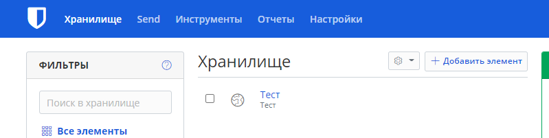
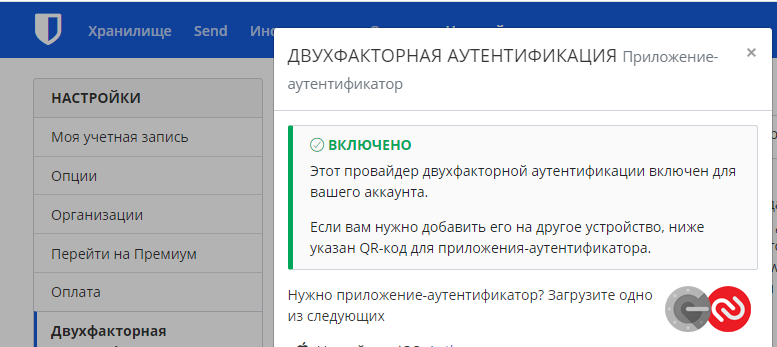
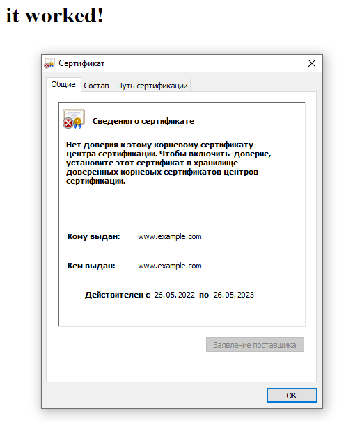
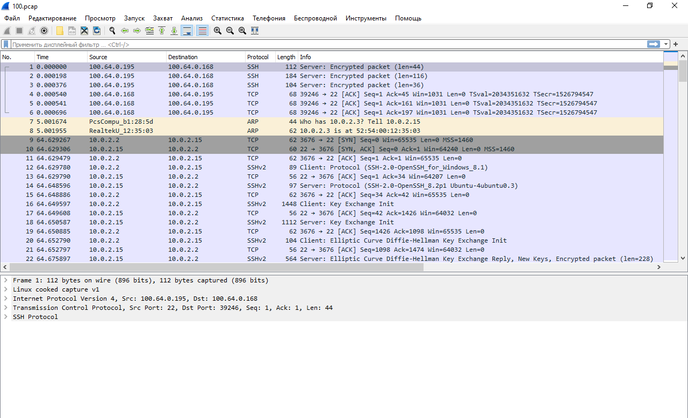

# Домашнее задание к занятию "3.9. Элементы безопасности информационных систем"

1. Установите Bitwarden плагин для браузера. Зарегестрируйтесь и сохраните несколько паролей.

2. Установите Google authenticator на мобильный телефон. Настройте вход в Bitwarden акаунт через Google authenticator OTP.

3. Установите apache2, сгенерируйте самоподписанный сертификат, настройте тестовый сайт для работы по HTTPS.
```bash
vagrant@vagrant:~$ sudo openssl req -x509 -nodes -days 365 -newkey rsa:2048 \
> -keyout /etc/ssl/private/apache-selfsigned.key \
> -out /etc/ssl/certs/apache-selfsigned.crt \
> -subj "/C=RU/ST=Moscow/L=Moscow/O=Company Name/OU=Org/CN=www.example.com"
Generating a RSA private key
.......+++++
...+++++
writing new private key to '/etc/ssl/private/apache-selfsigned.key'
-----
vagrant@vagrant:~$ cat /etc/apache2/sites-available/localsite.conf
    <VirtualHost *:443>
    ServerName 127.0.0.1
    DocumentRoot /var/www/localsite
    SSLEngine on
    SSLCertificateFile /etc/ssl/certs/apache-selfsigned.crt
    SSLCertificateKeyFile /etc/ssl/private/apache-selfsigned.key
    </VirtualHost>
vagrant@vagrant:~$ sudo mkdir /var/www/localsite
vagrant@vagrant:~$ sudo vim /var/www/localsite/index.html
vagrant@vagrant:~$ sudo a2ensite localsite.conf
Enabling site localsite.
To activate the new configuration, you need to run:
  systemctl reload apache2
vagrant@vagrant:~$ sudo apache2ctl configtest
AH00558: apache2: Could not reliably determine the server's fully qualified domain name, using 127.0.1.1. Set the 'ServerName' directive globally to suppress this message
Syntax OK  
vagrant@vagrant:~$ sudo systemctl reload apache2
```

4. Проверьте на TLS уязвимости произвольный сайт в интернете (кроме сайтов МВД, ФСБ, МинОбр, НацБанк, РосКосмос, РосАтом, РосНАНО и любых госкомпаний, объектов КИИ, ВПК ... и тому подобное).
```bash
Testing vulnerabilities

 Heartbleed (CVE-2014-0160)                not vulnerable (OK), no heartbeat extension
 CCS (CVE-2014-0224)                       not vulnerable (OK)
 Ticketbleed (CVE-2016-9244), experiment.  not vulnerable (OK)
 ROBOT                                     not vulnerable (OK)
 Secure Renegotiation (RFC 5746)           supported (OK)
 Secure Client-Initiated Renegotiation     not vulnerable (OK)
 CRIME, TLS (CVE-2012-4929)                not vulnerable (OK)
 BREACH (CVE-2013-3587)                    potentially NOT ok, "gzip" HTTP compression detected. - only supplied "/" tested
                                           Can be ignored for static pages or if no secrets in the page
 POODLE, SSL (CVE-2014-3566)               not vulnerable (OK)
 TLS_FALLBACK_SCSV (RFC 7507)              Downgrade attack prevention supported (OK)
 SWEET32 (CVE-2016-2183, CVE-2016-6329)    not vulnerable (OK)
 FREAK (CVE-2015-0204)                     not vulnerable (OK)
 DROWN (CVE-2016-0800, CVE-2016-0703)      not vulnerable on this host and port (OK)
                                           make sure you don't use this certificate elsewhere with SSLv2 enabled services, see
                                           https://search.censys.io/search?resource=hosts&virtual_hosts=INCLUDE&q=4B269947C6D304CD84D721D7DD2AA9BA29C076D5EA8587A05FF06EA84893E702
 LOGJAM (CVE-2015-4000), experimental      common prime with 2048 bits detected: RFC3526/Oakley Group 14 (2048 bits),
                                           but no DH EXPORT ciphers
 BEAST (CVE-2011-3389)                     TLS1: ECDHE-RSA-AES256-SHA
                                                 DHE-RSA-AES256-SHA
                                                 DHE-RSA-CAMELLIA256-SHA AES256-SHA
                                                 CAMELLIA256-SHA ECDHE-RSA-AES128-SHA
                                                 DHE-RSA-AES128-SHA
                                                 DHE-RSA-CAMELLIA128-SHA AES128-SHA
                                                 CAMELLIA128-SHA
                                           VULNERABLE -- but also supports higher protocols  TLSv1.1 TLSv1.2 (likely mitigated)
 LUCKY13 (CVE-2013-0169), experimental     potentially VULNERABLE, uses cipher block chaining (CBC) ciphers with TLS. Check patches
 Winshock (CVE-2014-6321), experimental    not vulnerable (OK)
 RC4 (CVE-2013-2566, CVE-2015-2808)        no RC4 ciphers detected (OK)
 ```
5. Установите на Ubuntu ssh сервер, сгенерируйте новый приватный ключ. Скопируйте свой публичный ключ на другой сервер. Подключитесь к серверу по SSH-ключу.
```bash
vagrant@vagrant:~$ ssh-keygen
Generating public/private rsa key pair.
Enter file in which to save the key (/home/vagrant/.ssh/id_rsa):
Enter passphrase (empty for no passphrase):
Enter same passphrase again:
Your identification has been saved in /home/vagrant/.ssh/id_rsa
Your public key has been saved in /home/vagrant/.ssh/id_rsa.pub  
vagrant@vagrant:~$ ssh-copy-id vagrant@100.64.0.195
/usr/bin/ssh-copy-id: INFO: Source of key(s) to be installed: "/home/vagrant/.ssh/id_rsa.pub"
The authenticity of host '100.64.0.195 (100.64.0.195)' can't be established.
ECDSA key fingerprint is SHA256:RztZ38lZsUpiN3mQrXHa6qtsUgsttBXWJibL2nAiwdQ.
Are you sure you want to continue connecting (yes/no/[fingerprint])?
/usr/bin/ssh-copy-id: INFO: attempting to log in with the new key(s), to filter out any that are already installed
The authenticity of host '100.64.0.195 (100.64.0.195)' can't be established.
ECDSA key fingerprint is SHA256:RztZ38lZsUpiN3mQrXHa6qtsUgsttBXWJibL2nAiwdQ.
Are you sure you want to continue connecting (yes/no/[fingerprint])? yes
/usr/bin/ssh-copy-id: INFO: 1 key(s) remain to be installed -- if you are prompted now it is to install the new keys
vagrant@100.64.0.195's password:  

Number of key(s) added: 1    

Now try logging into the machine, with:   "ssh 'vagrant@100.64.0.195'"  
and check to make sure that only the key(s) you wanted were added.
  
vagrant@vagrant:~$ ssh vagrant@100.64.0.195
Welcome to Ubuntu 20.04.3 LTS (GNU/Linux 5.4.0-91-generic x86_64)

 * Documentation:  https://help.ubuntu.com
 * Management:     https://landscape.canonical.com
 * Support:        https://ubuntu.com/advantage

  System information as of Fri 27 May 2022 04:42:40 PM UTC

  System load:  0.03               Processes:             120
  Usage of /:   11.8% of 30.88GB   Users logged in:       1
  Memory usage: 21%                IPv4 address for eth0: 10.0.2.15
  Swap usage:   0%                 IPv4 address for eth1: 100.64.0.195


This system is built by the Bento project by Chef Software
More information can be found at https://github.com/chef/bento
Last login: Fri May 27 16:34:25 2022 from 10.0.2.2
```
6. Переименуйте файлы ключей из задания 5. Настройте файл конфигурации SSH клиента, так чтобы вход на удаленный сервер осуществлялся по имени сервера.
```bash
vagrant@vagrant1:~$ sudo mv ~/.ssh/id_rsa ~/.ssh/id_rsa1
vagrant@vagrant1:~$ sudo vim ~/.ssh/config
vagrant@vagrant1:~$ cat vim ~/.ssh/config
host vagrant1
        HostName 100.64.0.195
        User vagrant
        Port 22
        IdentityFile ~/.ssh/id_rsa1 

vagrant@vagrant1:~$ ssh vagrant1
Welcome to Ubuntu 20.04.3 LTS (GNU/Linux 5.4.0-91-generic x86_64)

 * Documentation:  https://help.ubuntu.com
 * Management:     https://landscape.canonical.com
 * Support:        https://ubuntu.com/advantage

  System information as of Fri 27 May 2022 05:00:26 PM UTC

  System load:  0.0                Processes:             122
  Usage of /:   11.8% of 30.88GB   Users logged in:       1
  Memory usage: 22%                IPv4 address for eth0: 10.0.2.15
  Swap usage:   0%                 IPv4 address for eth1: 100.64.0.195


This system is built by the Bento project by Chef Software
More information can be found at https://github.com/chef/bento
Last login: Fri May 27 16:42:40 2022 from 100.64.0.168
vagrant@vagrant1:~$ exit
logout
Connection to 100.64.0.195 closed.
```
7. Соберите дамп трафика утилитой tcpdump в формате pcap, 100 пакетов. Откройте файл pcap в Wireshark.
```bash
vagrant@vagrant1:~$ sudo tcpdump -nnei any -c 100 -w 100.pcap
tcpdump: listening on any, link-type LINUX_SLL (Linux cooked v1), capture size 262144 bytes
100 packets captured
138 packets received by filter
0 packets dropped by kernel 
```
```commandline
D:\vagrant1>scp.exe -P 22 100.pcap vagrant@100.64.0.195:~100.pcap
vagrant@100.64.0.195's password:
100.pcap                                              100%   14KB   4.7MB/s   00:00
```

 ---
## Задание для самостоятельной отработки (необязательно к выполнению)

8*. Просканируйте хост scanme.nmap.org. Какие сервисы запущены?
```bash
vagrant@vagrant:~$ nmap scanme.nmap.org
Starting Nmap 7.80 ( https://nmap.org ) at 2022-05-26 20:02 UTC
Nmap scan report for scanme.nmap.org (45.33.32.156)
Host is up (0.18s latency).
Other addresses for scanme.nmap.org (not scanned): 2600:3c01::f03c:91ff:fe18:bb2f
Not shown: 996 filtered ports
PORT      STATE SERVICE
22/tcp    open  ssh
80/tcp    open  http
9929/tcp  open  nping-echo
31337/tcp open  Elite
```
9*. Установите и настройте фаервол ufw на web-сервер из задания 3. Откройте доступ снаружи только к портам 22,80,443
```bash
vagrant@vagrant:~$ sudo ufw status verbose
Status: active
Logging: on (low)
Default: deny (incoming), allow (outgoing), disabled (routed)
New profiles: skip

To                         Action      From
--                         ------      ----
80                         ALLOW IN    Anywhere
22                         ALLOW IN    Anywhere
443                        ALLOW IN    Anywhere
80 (v6)                    ALLOW IN    Anywhere (v6)
22 (v6)                    ALLOW IN    Anywhere (v6)
443 (v6)                   ALLOW IN    Anywhere (v6)
```

 ---

## Как сдавать задания

Обязательными к выполнению являются задачи без указания звездочки. Их выполнение необходимо для получения зачета и диплома о профессиональной переподготовке.

Задачи со звездочкой (*) являются дополнительными задачами и/или задачами повышенной сложности. Они не являются обязательными к выполнению, но помогут вам глубже понять тему.

Домашнее задание выполните в файле readme.md в github репозитории. В личном кабинете отправьте на проверку ссылку на .md-файл в вашем репозитории.

Также вы можете выполнить задание в [Google Docs](https://docs.google.com/document/u/0/?tgif=d) и отправить в личном кабинете на проверку ссылку на ваш документ.
Название файла Google Docs должно содержать номер лекции и фамилию студента. Пример названия: "1.1. Введение в DevOps — Сусанна Алиева".

Если необходимо прикрепить дополнительные ссылки, просто добавьте их в свой Google Docs.

Перед тем как выслать ссылку, убедитесь, что ее содержимое не является приватным (открыто на комментирование всем, у кого есть ссылка), иначе преподаватель не сможет проверить работу. Чтобы это проверить, откройте ссылку в браузере в режиме инкогнито.

[Как предоставить доступ к файлам и папкам на Google Диске](https://support.google.com/docs/answer/2494822?hl=ru&co=GENIE.Platform%3DDesktop)

[Как запустить chrome в режиме инкогнито ](https://support.google.com/chrome/answer/95464?co=GENIE.Platform%3DDesktop&hl=ru)

[Как запустить  Safari в режиме инкогнито ](https://support.apple.com/ru-ru/guide/safari/ibrw1069/mac)

Любые вопросы по решению задач задавайте в чате учебной группы.

---

