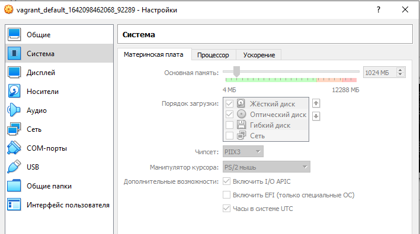
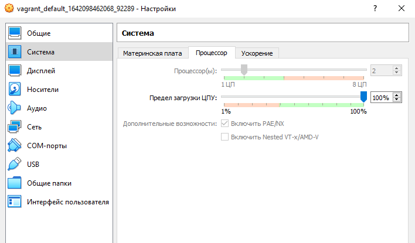
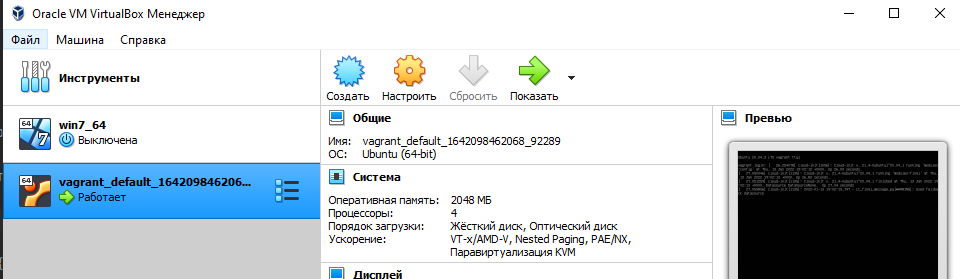

5. Ознакомьтесь с графическим интерфейсом VirtualBox, посмотрите как выглядит виртуальная машина, которую создал для вас Vagrant, какие аппаратные ресурсы ей выделены. Какие ресурсы выделены по-умолчанию?  
Ресурсы по умолчанию  

6. Ознакомьтесь с возможностями конфигурации VirtualBox через Vagrantfile: документация. Как добавить оперативной памяти или ресурсов процессора виртуальной машине?    

    config.vm.provider "virtualbox" do |v|  
    v.memory = 2048  
    v.cpus = 4  
    end  

7. Команда vagrant ssh из директории, в которой содержится Vagrantfile, позволит вам оказаться внутри виртуальной машины без каких-либо дополнительных настроек. Попрактикуйтесь в выполнении обсуждаемых команд в терминале Ubuntu.

PS D:\vagrant> vagrant ssh
Welcome to Ubuntu 20.04.3 LTS (GNU/Linux 5.4.0-91-generic x86_64)

 * Documentation:  https://help.ubuntu.com
 * Management:     https://landscape.canonical.com
 * Support:        https://ubuntu.com/advantage

  System information as of Thu 13 Jan 2022 07:05:40 PM UTC

  System load:  0.12               Processes:             143
  Usage of /:   11.4% of 30.88GB   Users logged in:       0
  Memory usage: 9%                 IPv4 address for eth0: 10.0.2.15
  Swap usage:   0%

This system is built by the Bento project by Chef Software
More information can be found at https://github.com/chef/bento
vagrant@vagrant:~$ ll
total 36
drwxr-xr-x 4 vagrant vagrant 4096 Dec 19 19:45 ./  
drwxr-xr-x 3 root    root    4096 Dec 19 19:42 ../  
-rw-r--r-- 1 vagrant vagrant  220 Feb 25  2020 .bash_logout  
-rw-r--r-- 1 vagrant vagrant 3771 Feb 25  2020 .bashrc  
drwx------ 2 vagrant vagrant 4096 Dec 19 19:42 .cache/  
-rw-r--r-- 1 vagrant vagrant  807 Feb 25  2020 .profile  
drwx------ 2 vagrant root    4096 Jan 13 18:32 .ssh/  
-rw-r--r-- 1 vagrant vagrant    0 Dec 19 19:42 .sudo_as_admin_successful  
-rw-r--r-- 1 vagrant vagrant    6 Dec 19 19:42 .vbox_version  
-rw-r--r-- 1 root    root     180 Dec 19 19:44 .wget-hsts  

8. Ознакомиться с разделами man bash, почитать о настройках самого bash:

какой переменной можно задать длину журнала history, и на какой строчке manual это описывается?  
HISTFILESIZE - максимальное число строк в файле истории, 554 строка  
HISTSIZE - количество комманд в истории комманд, 562 строка  

что делает директива ignoreboth в bash?  
сокращение для директив ignorespace and ignoredups, запрещает сохранение в истории комманд строк начинающихся с пробела и дубликатов комманд    

9. В каких сценариях использования применимы скобки {} и на какой строчке man bash это описано?  
{} - зарезервированные слова, могут использоваться для описания списков в коммандах например создания каталогов по списку mkdir DIR{ 1..10 } создаст каталоги от DIR1 до DIR10, 186 строка  

10. С учётом ответа на предыдущий вопрос, как создать однократным вызовом touch 100000 файлов? Получится ли аналогичным образом создать 300000? Если нет, то почему?  
touch F{1..100000}  
300000 не получилось - слишком длинный список аргументов. Максимум что получилось экспериментальным путем: touch F_{1..129758}  

11. В man bash поищите по /\[\[. Что делает конструкция [[ -d /tmp ]]  
[[ ]] это составная команда  
-d возвращает истину если существует файл или дирректория
[[ -d /tmp ]] вернет истину т.к. дирректория /tmp существует
[[ -d /tmp ]]  
echo $?  
0 - успешное выполнение команды  

12. Основываясь на знаниях о просмотре текущих (например, PATH) и установке новых переменных; командах, которые мы рассматривали, добейтесь в выводе type -a bash в виртуальной машине наличия первым пунктом в списке:

bash is /tmp/new_path_directory/bash
bash is /usr/local/bin/bash
bash is /bin/bash
(прочие строки могут отличаться содержимым и порядком) В качестве ответа приведите команды, которые позволили вам добиться указанного вывода или соответствующие скриншоты.

mkdir /tmp/new_path_directory/  
cp /bin/bash /tmp/new_path_directory  
PATH=/tmp/new_path_directory/:$PATH  
type -a bash  
    bash is /tmp/new_path_directory/bash  
    bash is /usr/bin/bash  
    bash is /bin/bash  

13. Чем отличается планирование команд с помощью batch и at?
at      запускает команды в указанное время
batch   запускает команды при оределннном уровне загрузки системы (1,5 или определенном при запуске atd)  
14. Завершите работу виртуальной машины чтобы не расходовать ресурсы компьютера и/или батарею ноутбука.  
exit  
vagrant suspend
